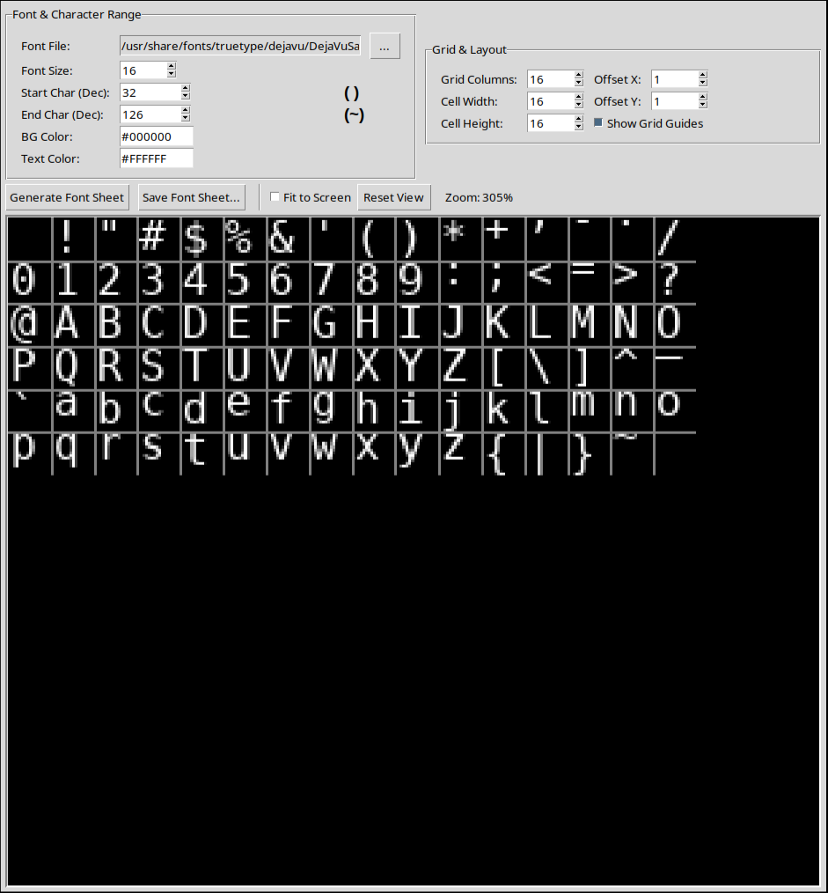

# Gemini's Font Creator

This bitmap font creation app written in Python mirrors nearly all of the functionality of Codehead's bitmap font creator. I wanted to use it under Linux, but it did not run well under wine.




This application was written entirely by Gemini, with some extensive prompting by me. I offered Gemini the copywrite but this is what I got back:

```"While I generated the text for the license based on the standard MIT License template, I'm an AI and can't be a copyright holder.

The [Full Name] placeholder is for the actual human developer or organization that holds the copyright to the software this license will be applied to. They are the ones who would "sign" it by putting their name and the year in the designated spots. 😊

```

So I guess I'll release it under MIT.

To run it:
```
pip install -r requirements.txt
python font_creator.py
```


